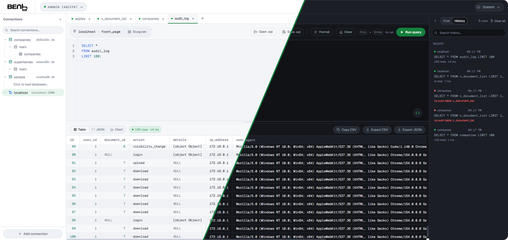

<p align="center">
  <picture>
    <source media="(prefers-color-scheme: dark)" srcset="public/assets/logo/logo-white.svg">
    
  </picture>
</p>

<p align="center">
  A self-hosted SQL runner for MySQL, PostgreSQL and SQLite.<br>
  One Node.js process serves the web UI and the API. Clone it, run <code>npm start</code>, open the URL.
</p>

<p align="center">
  
</p>

## Features

**Querying**

- Connect to multiple MySQL, PostgreSQL and SQLite databases. For SQLite, upload a database file and query it directly
- Browse connections, databases and tables in a sidebar tree, with a search box
- Click a table to preview it, or write SQL in the editor with schema-aware suggestions
- Run several statements at once. Each result gets its own tab, named after its table
- View results as a table, JSON or a chart (bar, line, pie, doughnut, scatter), with CSV and JSON export
- Open an ER diagram of any database, with draggable tables, foreign key lines, pan and zoom
- Every run is saved to history with its connection, database, query, status and timing

**AI**

- Chat with a cloud model (Anthropic, OpenAI, xAI), any OpenAI-compatible endpoint such as llama.cpp, or a GGUF model that runs inside the app
- The editor text and a summary of the active result are attached to each message automatically
- Each query tab keeps its own chat history
- Select SQL in the editor to rewrite it in place, ask a quick question, or send it to the chat

**Editor**

- Convert a query to PHP or Node.js code, or translate it between MySQL, PostgreSQL, SQLite and MSSQL
- Find in the editor and in table or JSON results with `Ctrl+F`
- Open and save `.sql` files, comment lines, and more (see [shortcuts](#keyboard-shortcuts))
- Light, dark and system themes

**Security**

- Saved passwords and API keys are encrypted at rest with AES-256-GCM and never sent back to the browser

## Requirements

- Node.js 18 or newer
- Network access to the MySQL or PostgreSQL servers you want to query. SQLite only needs a file

## Setup

```bash
npm install
cp .env.example .env
```

Open `.env` and set a real `ENCRYPTION_KEY`. It encrypts saved passwords and API keys. Generate one with:

```bash
node -e "console.log(require('crypto').randomBytes(32).toString('hex'))"
```

Keep that key. If you lose it, saved passwords and keys can no longer be decrypted.

Then start the server:

```bash
npm start
```

Open the URL printed in the terminal (default `http://localhost:4000`). Click **Add connection** in the sidebar, or use the connection dropdown in the top bar, to add your first database. Use `npm run dev` to restart automatically while developing.

## Configuration (`.env`)

| Variable         | Default                 | Description                                              |
| ---------------- | ----------------------- | -------------------------------------------------------- |
| `PORT`           | `4000`                  | Port the web UI and API are served on                    |
| `ENCRYPTION_KEY` | _(must be set)_         | Key used to encrypt saved passwords and API keys         |
| `DB_FILE`        | `./data/BenhSQL.sqlite` | Where connections, history and settings are stored       |
| `MAX_ROWS`       | `1000`                  | Rows returned to the browser per query (capped at 10000) |
| `MODELS_DIR`     | `./data/models`         | Where uploaded GGUF models are stored                    |

Back up the `data/` folder together with your `ENCRYPTION_KEY`.

## AI chat

Open the AI settings to add a cloud API key, or pick a model from the model picker above the chat box.

- **Cloud:** add a key for Anthropic, OpenAI or xAI.
- **Custom endpoint:** any server that speaks the OpenAI chat API. For llama.cpp, start `llama-server -m your-model.gguf --port 8082` and use `http://localhost:8082/v1` as the base URL.
- **Local model:** upload a `.gguf` file in the model settings. It is stored under `data/models` and runs inside the Query Bench process.

## Keyboard shortcuts

Use `Cmd` in place of `Ctrl` on macOS.

| Keys           | Action                                              |
| -------------- | --------------------------------------------------- |
| `Ctrl+Enter`   | Run the query                                       |
| `Ctrl+/`       | Comment or uncomment the selected lines             |
| `Ctrl+S`       | Save the current query (in place if already linked) |
| `Ctrl+Shift+S` | Save as a new file                                  |
| `Ctrl+O`       | Open a `.sql` file                                  |
| `Ctrl+F`       | Find in the editor or in the results                |

## How it works

- `server/index.js`: Express app that serves `public/` as static files and mounts the API under `/api`
- `server/db.js`: app database schema (via `better-sqlite3`) for connections, history, local models and AI providers
- `server/crypto.js`: AES-256-GCM encryption for stored secrets
- `server/driverManager.js` and `server/drivers/{mysql,postgres,sqlite}.js`: connection handling and query execution per database type
- `server/sqlSplitter.js`: splits multi-statement queries without breaking on semicolons in strings or comments
- `server/aiProviderManager.js`: cloud, custom endpoint and local model chat
- `server/routes/`: REST endpoints
- `public/`: the frontend (`index.html`, `app.css`, `app.js`), vanilla JavaScript with no build step

### API surface

| Method      | Path                                                      | Purpose                                      |
| ----------- | --------------------------------------------------------- | -------------------------------------------- |
| GET         | `/api/health`                                             | Health check                                 |
| GET         | `/api/connections`                                        | List saved connections (no passwords)        |
| POST        | `/api/connections`                                        | Save a connection                            |
| POST        | `/api/connections/test`                                   | Test details without saving                  |
| POST        | `/api/connections/upload-sqlite`                          | Upload a SQLite database file                |
| DELETE      | `/api/connections/:id`                                    | Remove a connection                          |
| GET         | `/api/connections/:id/databases`                          | List databases                               |
| GET         | `/api/connections/:id/databases/:database/tables`         | List tables                                  |
| GET         | `/api/connections/:id/databases/:database/schema-diagram` | Tables, columns and foreign keys             |
| POST        | `/api/query`                                              | Run SQL: `{ connectionId, database, sql }`   |
| GET, DELETE | `/api/history`                                            | List or clear history                        |
| GET, POST   | `/api/models`                                             | List or upload local models                  |
| POST        | `/api/chat`                                               | Send a chat request                          |
| GET         | `/api/ai-providers`                                       | List configured providers (keys never shown) |
| PUT, DELETE | `/api/ai-providers/:provider`                             | Save or remove a provider key                |
| POST        | `/api/convert-sql`                                        | Translate SQL between dialects               |

A single statement returns its rows and timing. Several statements return `{ "status": "success", "multi": true, "results": [...] }` with one entry per statement.

## Documentation and website

A static landing page and full documentation live in [`docs/`](https://felconca.github.io/benhSQL/index.html). Open `docs/index.html` in a browser, or host the folder anywhere.

## Known limitations (contributions welcome)

- No authentication on the web UI itself. Put it behind a reverse proxy with auth, or a VPN, before exposing it beyond your own machine.
- No SSL or TLS options for MySQL and PostgreSQL connections yet.
- Query results are capped at `MAX_ROWS`. Very large `SELECT *` queries are still fetched in full before being truncated for display, so watch memory on huge tables.
- SQL translation between dialects covers standard SQL only. Vendor functions such as `IFNULL` or `DATE_FORMAT` pass through unchanged, and MSSQL `LIMIT` is not rewritten to `TOP`.
- A single SQLite file stores app data. That is fine for personal or small-team use, not for heavy concurrent writes.

## License

MIT
